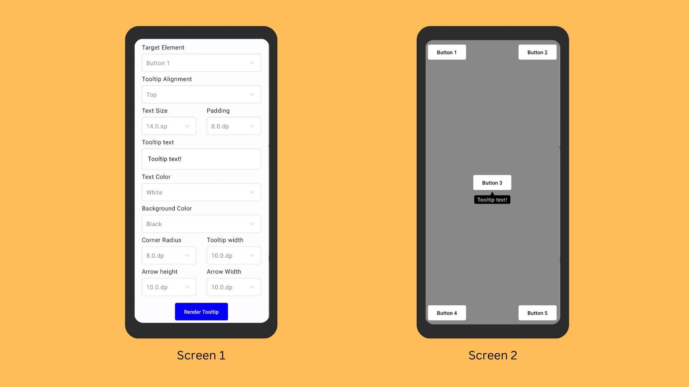

## Made using:

- Jetpack Compose

- Material3

- Flows

- ViewModel

## Features
1. **Customisation**
   - Set target element, alignment, style, and text of the tooltip.
   
2. **Mobile Screen Preview**
    - A preview of a mobile screen with button elements.
    - Buttons act as the target elements for rendering the tooltips.

